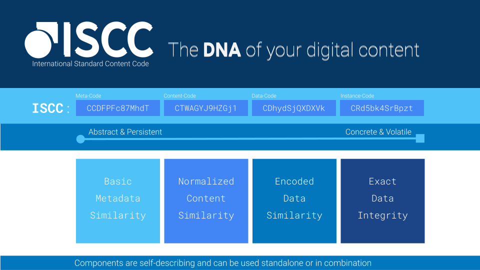

title: ISCC - Content Identifiers
description: The intelligent digital media identifier.
authors: Titusz Pan

# ISCC - Content Identifiers

## A Proposal for a Modern and Open Content-Based Identifier

## The ISCC is...

- a universal identifier for multiple generic media-types (text, image, audio, video)
- a lightweight and similarity-preserving fingerprint designed for digital content
- designed for cross-sector applicability (journalism, books, music, film, etc.)
- designed to identify content in decentralized and networked environments
- and most importantly it is free, open-source and transparent

**You want to try it instantly?** Head over to our demo at https://iscc.coblo.net

## Motivation

Increasing amounts of dynamic, short-lived, and granular content need to be managed and require new and innovative tools.

A crucial prerequisite for content-related transactions to succeed in this new and demanding environment is the capability to address and identify content efficiently. Yet many industries that deal with digital content do not even have standard identifiers. There is no existing solution for those industries that deal with short-lived or granular content such as journalism. There is also no widely adopted standardized identifier for digital images.

The overhead and cost of manually assigning and tracking identifiers for such content are prohibitive. But there is a solution to the problem: **auto-generated identifiers** created algorithmically from the content itself.

With the advent of blockchain technology, the Internet is moving towards a network of peer-to-peer transactions.

In a multi-sided ecosystem, **anybody** may have a legitimate interest to generate, lookup, or register an identifier for some digital content – whether they own the content or not.

Authorship or copyright is **not** a requirement to create or use an identifier. But **an identifier is a requirement** to communicate and agree on authorship, origin, copyright, and other information.

Technology allows us to authoritatively map **identifiers to digital content** using open, standardized fingerprinting algorithms.

Open and accessible **standard identifiers,** designed to manage small and sometimes transient pieces of digital content are fundamental for transactions and sales activities in our increasingly heterogeneous media environment.

By using standardized, decentralized, algorithmic identifiers for digital content, all ecosystem participants can engage more efficiently in content-related transactions.

## Key Features and Differentiators

- Decentralized issuance through algorithmic creation
- Generic content identification (text, images, audio, video)
- Algorithmic similarity detection and deduplication
- Low management costs
- Low barrier of entry
- Designed for blockchain based registration

## How it works

**ISCC** identifiers are generated algorithmically **from the content itself**. Content files are processed to build the identifier. The ISCC does not have to be manually assigned, neither does it have to be carried around or embedded within the content. The content itself is the source and authority of the **ISCC Code**.

The **ISCC Code** is a unique, hierarchically structured, composite identifier. It is built from a generic and balanced mix of content-derived, locality-sensitive and similarity-preserving hashes generated from metadata and content.

The latest version of these pages can be found at [iscc.codes](http://iscc.codes)
